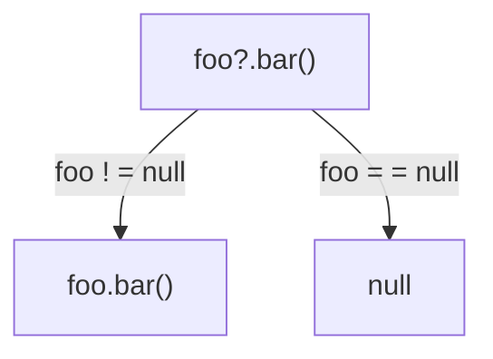
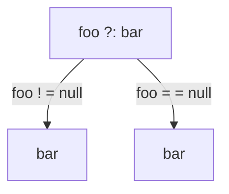
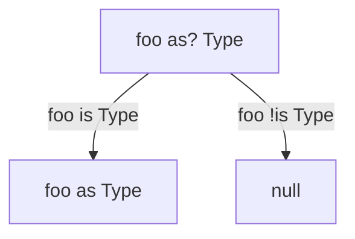

# [Kotlin Roadmap](../roadmap.pdf)

<!-- TOC -->
* [Kotlin Roadmap](#kotlin-roadmap)
* [`class` / `object`](#class--object)
  * [Modifiers](#modifiers)
    * [`enum` class](#enum-class)
    * [`data` class](#data-class)
      * [`equals` and reference equality](#equals-and-reference-equality)
    * [`sealed` class](#sealed-class)
    * [Class delegation with `by`](#class-delegation-with-by)
  * [Package structure](#package-structure)
  * [Inheritance](#inheritance)
  * [`object`](#object)
    * [`companion object`](#companion-object)
  * [Functions](#functions)
    * [Constructors](#constructors)
  * [Properties](#properties)
    * [Lazy and late initialization](#lazy-and-late-initialization)
* [Exceptions](#exceptions)
* [Lambdas](#lambdas)
  * [Extensions](#extensions)
  * [Inline functions](#inline-functions)
* [Nullability](#nullability)
    * [Generics](#generics)
* [Collections and Sequences](#collections-and-sequences)
<!-- TOC -->

Kotlin is compiled to Java bytecode, which provides the backward compatability. When wishing to see Kotlin in real-life
use J2K converter can be used to convert part of source code into Kotlin. Another way is to start writing unit tests in
Kotlin.

Kotlin standard library is just Java standard library and a bunch of [extensions](#extensions) that provides very smooth
interoperability between Java code and Kotlin code.

In `IntelliJ` we can use the `Show Kotlin bytecode` + `Decompile` features to see the Java alternative for the Kotlin
code.

Reference on Kotlin conventions

- [Kotlin for Java developers course part](https://www.coursera.org/learn/kotlin-for-java-developers/lecture/fZtQF/conventions)
- [Kotlin coding conventions](https://kotlinlang.org/docs/coding-conventions.html)

# `class` / `object`

## Modifiers

We can declare constants with `const` modifier, and it's going to be substituted with the value on the JVM level. It
works only for primitive types.

| modifier   | explanation                                                 |
|------------|-------------------------------------------------------------|
| `final`    | cannot be overridden (is sed by default)                    |
| `open`     | can be overridden                                           |
| `abstract` | must be overridden (can't have implementation)              |
| `override` | overrides a member in a superclass or interface (mandatory) |

| modifier    | class member                 | top-level declaration |
|-------------|------------------------------|-----------------------|
| `public`    | visible everywhere           | visible everywhere    |
| `internal`  | visible in the module        | visible in the module |
| `protected` | visible in subclasses (only) | –                     |
| `private`   | visible in the class         | visible in the file   |

| kotlin modifier | jvm level                     |
|-----------------|-------------------------------|
| `public`        | `public`                      |
| `protected`     | `protected`                   |
| `private`       | `private` / `package private` |
| `internal`      | `public` & name ruining       |

### `enum` class

In kotlin `enum` is a modifier for classes to create enumerations

### `data` class

Generates `equals`, `hashCode`, `copy`, `toString`

#### `equals` and reference equality

In kotlin `==` calls `equals`. There is also `===` operator which checks reference equality. Bare `class` `eqauls` uses
reference equality check.

```kotlin
val set1 = setOf(1, 2, 3)
val set2 = setOf(1, 2, 3)

set1 == set2 // true
set1 === set2 // false
```

We can still exclude props from the basic methods in a `data class`by moving them outside the primary constructor.

```kotlin
data class User(val email: String) {
    val nickname: String? = null
}
```

### `sealed` class

Restricts class hierarchy, all subclasses must be located in the sames file.

### Class delegation with `by`

We can delegate methods from one class another. We don't need to write boilerplate code for it.

```kotlin
interface Printer {
    fun printMessage(message: String)
}

class ConsolePrinter : Printer {
    override fun printMessage(message: String) {
        pirntln(message)
    }
}

class PrinterManager(printer: Printer) : Printer by printer

fun main() {
    val consolePrinter = ConsolePrinter()
    val manager = PrinterManager(consolePrinter)

    manager.printMessage("Hi there!") // <-- we are calling a method, the code of which 
    // we did not write in PrinterManager explicitly
}
```

## Package structure

In kotlin we can put multiple classes inside one file, this file can also contain top-level statements

## Inheritance

```kotlin
interface Base
class BaseImpl : Base
```

```kotlin
open class Parent
class Child : Parent() // <-- () is the constructor call, so we can pass parameters there if any
```

## `object`

`object` = singleton

`java`

```java
public class JSingleton {
    public final static JSingleton INSTANCE = new JSingleton();

    private JSignleton() {
    }

    private foo() {
    }
}
```

`kotlin`

```kotlin
object KSingleton {
    fun foo() {}
}
```

### `companion object`

In kotlin there are no `static` methods and `companion object`s might be a replacement for that.

```kotlin
class A {
    companion object {
        fun foo() = 1
    }
}

fun main(args: Array<String>) {
    A.foo()
}
```

Companion objects can implement interfaces and be receiver of extension function.

```kotlin
interface Factory<T> {
    fun create(): T
}

class A {
    private constructor()

    companion object : Factory<A> {
        override fun create(): A {
            return A()
        }
    }
}

fun <T> createNewInstance(factory: Factory<T>) { /* some code */
}

createNewInstance(A)
A.create()
```

```kotlin
class Person(val firstName: String, val lastName: String) {
    companion object {}
}

fun Person.Companion.fromJson(json: String): Person {
    // ... 
}

val p = Person.fromJson(json)
```

Not all objects are singletons, object expressions are the java's anonymous class alternative. They are used for the
cases when we have to override multiple methods, otherwise we could just use lambdas.

```kotlin
widnow.addMouseListener() {
    object : MouseAdapter() {
        override fun mouseClicked(e: MouseEvent) {
            // ..
        }

        override fun mouseEntered(e: MouseEvent) {
            // ..
        }
    }
}
```

## Functions

There are no `static` members in kotlin. The closest thing to that would be:

- top-level statements
- `object`s' members
- `companion object`s' members

Calling a top-level function from Java:

```kotlin
package intro

fun foo() = 0
```

```java
packge other;

import intro.MyFileKt;

public class UsingFoo {
    public static void main(String[] args) {
        MyFileKt.foo();
    }
}
```

We can use the `@JvmName` to change the name of the package to import.

```kotlin
@file:JvmName("Util")

package intro

fun foo() = 0
```

```java
packge other;

import static intro.Util;

public class JavaUsage {
    public static void main(String[] args) {
        into i = Util.foo();
    }
}
```

### Constructors

```kotlin
class A

val a = A() // <-- calling a default constructor 
```

Full primary constructor syntax looks like this. `val` or `var` in the constructor would automatically create a
property. Constructor's visibility can be changed.

```kotlin
class Person(name: String) { // <-- name is a constructor parameter
    val name: String

    init {
        this.name = name
    }
}
```

We can declare secondary constructors and must use the primary constructor.

```kotlin
class Rectangle(val height: Int, val width: Int) {
    constructor(side: Int) : this(side, side) { /* some logic */
    }
}
```

## Properties

`Kotlin`

```kotlin
contact.address
contact.address = "..."
```

`Java`

```java
contact.getAddress();
contact.

setAdderss("...");
```

`property` = `accessor(s)`

`val` = `getter`

`var` = `getter` + `setter`

If the `field` is not mentioned in custom accessor then no backing field is generated. All properties are `open`.

### Lazy and late initialization

Lazy props' values is calculated on the first access.

```kotlin
val lazyValue: String by lazy {
    println("completed!")
    "Hello"
}
```

`lateinit` is useful when we want to initialize the values not in the constructor and not to use nullable accessors
everywhere. If the property was not initialize a runtime `UninitializedPropertyAccessException` is thrown. `lateinit`
can't be `val`, can't be nullable or of a primitive type.

```kotlin
class KotlinActivity : Activity() {
    lateinit var myData: MyData

    override fun onCreate(savedInstanceState: Budnle?) {
        super.onCreate(savedInstanceState)

        myData = intent.getParcelableExtra("MY_DATA")
    }
}
```

```kotlin
myData.foo // we can call props of myData with no safe accessors
```

# Exceptions

In Kotlin, there is no difference between checked and unchecked exceptions. There are no checked exceptions in Kotlin so
there is no need to specify this function throws at this exception. Kotlin's library still has a `@Throws` annotation.
When we throw a checked exception from Java point of view in Kotlin and want to later handle it in Java, we need to add
this annotation.

Java code calling `foo()` won't compile.

```kotlin
fun foo() {
    throw IOException()
}
```

Java code calling `bar()` will compile.

```kotlin
@Throws(IOException::class)
fun bar() {
    throw IOException()
}
```

# Lambdas

If lambda is the last argument in a function we can move it out of the presences

```kotlin
list.any { i: Int -> i > 0 }
```

`it` or `this` can denote the argument if it's only one

```kotlin
list.any { it > 0 }
```

the last expression is the result

```kotlin
list.any {
    println("processing $it")
    it > 0 // is the same as return it > 0
}
```

we can destruct arguments

```kotlin
map.mapValues { (key, value) -> "$key -> $value!" }
```

example of storing a lambda in a variable of type `(Int, Int) -> Int`

```kotlin
val sum: (Int, Int) -> Int = { x, y -> x + y }
```

Bound reference store the object on which the member can delay to called, while unbound can be called on any object of a
given type

`Bound`

```kotlin
class Person(val name: String, val age: Int) {
    fun isOlder(ageLimit: Int) = age > ageLimit

    fun getAgePredicate() = this::isOlder // <- here is a bound reference
}
```

`Unbound`

```kotlin
fun isEven(i: Int): Boolean = i % 2 == 0
::isEven
```

`return` in lambdas

A return inside a `fun` would return from the whole function

```kotlin
fun duplicateNonZero(list: List<Int>): List<Int> {
    return list.flatMap {
        if (it == 0) return listOf()
        listOf(it, it)
    }
}

println(duplicateNonZero(listOf(3, 0, 5))) // would return [] - an empty list 
```

We can specify what lambda to return from so that we do not return from the whole function (`@`)

```kotlin
fun duplicateNonZero(list: List<Int>): List<Int> {
    return list.flatMap {
        if (it == 0) return@flatMap listOf()
        listOf(it, it)
    }
}
```

The labeled return inside a `forEach` actually corresponds to java's `continue`

```kotlin
list.forEach {
    if (it == 0) return@forEach
    println(it)
}
```

is the same as

```kotlin
for (element in list) {
    if (element == 0) continue
    print(element)
}
```

## Extensions

Kotlin's extensions are basically static functions defined in a separate auxiliary class. We can't call private members
from extensions. As extension functions are static under the hood they cannot be overridden. Properties can be extended.

```kotlin
fun String.lastChar() = this[this.length - 1]
```

Reference of the [coding convention](https://kotlinlang.org/docs/coding-conventions.html#source-file-organization)

... when defining extension functions for a class which are relevant for all clients of this class, put them in the same
file with the class itself. When defining extension functions that make sense only for a specific client, put them next
to the code of that client. Avoid creating files just to hold all extensions of some class.

## Inline functions

Inlining a function means that compiler will substitute a body of the function instead of calling it. No anonymous class
will be created for it.

```kotlin
inline fun <R> run(block: () -> R): R = block()

val name = "Kotlin"
run { println("Hi, $name!") }
```

Will be compiled to the bytecode

```kotlin
val name = "Kotlin"
println("Hi, $name!") // inlined code of lambda body
```

### Resource management with `use`

`java`

```java
import java.io.BufferedReader;
import java.io.FileReader;
import java.io.IOException;

static String readFirstLineFormFile(String path) throws IOException {
  try (BufferedReader br = new BufferedReader(new FileReader(path))) {
    return br.readLine();
  }
}
``` 

`kotlin`

```kotlin
import java.io.BufferedReader
import java.io.FileReader

fun readFirstLineFromFile(path: String): String {
    BufferedReader(FileReader(path)).use { br ->
        return br.readLine()
    }
}
```

# Nullability

Kotlin took the approach of making NPE a compile-time exception. Each type is a child of the same nullable type. Under
the hood `fun foo(): String? = "foo"` is

```java

@Nullable
public static final String foo() {
    return "foo";
}
```

`fun bar(): String = "bar"` is

```java

@NotNull
public static final String foo() {
    return "foo";
}
```

Operators to work with nullability in Kotlin

`!!`

`s!!` - throws NPE if `s` is null

`?.`



`?:`



`as?`



### Generics

A regular generic argument (`T` for example) can receive a nullable type. We can make it explicit.

```kotlin
fun <T> List<T>.firstOrNull(): T? {}
```

At the same time we can set a non-nullable upper bound with `Any`.

```kotlin
fun <T : Any> foo(list: List<T>) {
    for (element in list) {
        
    }
}
```

If we need to use multiple constraints for a type parameter we must use the `where`.

```kotlin
fun <T> ensureTrailingPeriod(seq: T) where T : CharSequence, T : Appendable {
    if (!seq.endsWith('.')) {
        seq.append('.')
    }
}
```

In situations when generics result in the same JVM signature we must use `@JvmName` to resolve the conflict.

```kotlin
fun List<Int>.average(): Duble { }
@JvmName("averageOfDouble")
fun List<Double>.average(): Double { }
```

# Collections and Sequences
