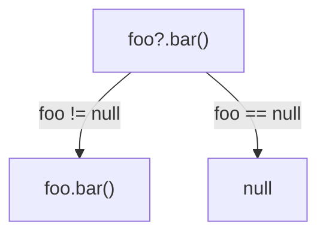
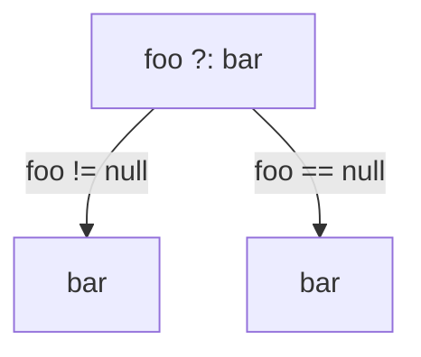
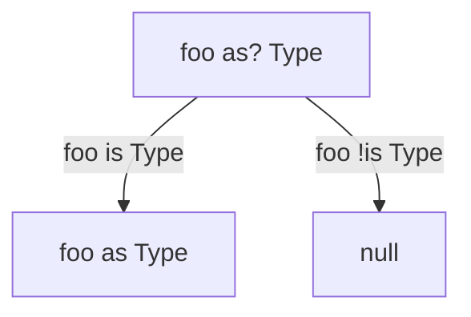

# [Kotlin Roadmap](../roadmap.pdf)

Kotlin is compiled to Java bytecode, which provides the backward compatability. When wishing to see Kotlin in real-life
use J2K converter can be used to convert part of source code into Kotlin. Another way is to start writing unit tests in
Kotlin.

Kotlin standard library is just Java standard library and a bunch of [extensions](#extensions) that provides very smooth
interoperability between Java code and Kotlin code.

In `IntelliJ` we can use the `Show Kotlin bytecode` + `Decompile` features to see the Java alternative for the Kotlin
code.

# `class` / `object` members

## Functions

Calling a top-level function from Java

```kotlin
package intro

fun foo() = 0
```

```java
packge other;

import intro.MyFileKt;

public class UsingFoo {
    public static void main(String[] args) {
        MyFileKt.foo();
    }
}
```

We can use the `@JvmName` to change the name of the package to import.

```kotlin
@file:JvmName("Util")

package intro

fun foo() = 0
```

```java
packge other;

import static intro.Util;

public class JavaUsage {
    public static void main(String[] args) {
        into i = Util.foo();
    }
}
```

### Constructors

## Properties

# Exceptions

In Kotlin, there is no difference between checked and unchecked exceptions. There are no checked exceptions in Kotlin so
there is no need to specify this function throws at this exception. Kotlin's library still has a `@Throws` annotation.
When we throw a checked exception from Java point of view in Kotlin and want to later handle it in Java, we need to add
this annotation.

Java code calling `foo()` won't compile.

```kotlin
fun foo() {
    throw IOException()
}
```

Java code calling `bar()` will compile.

```kotlin
@Throws(IOException::class)
fun bar() {
    throw IOException()
}
```

# Lambdas

If lambda is the last argument in a function we can move it out of the presences

```kotlin
list.any { i: Int -> i > 0 }
```

`it` or `this` can denote the argument if it's only one

```kotlin
list.any { it > 0 }
```

the last expression is the result

```kotlin
list.any {
    println("processing $it")
    it > 0 // is the same as return it > 0
}
```

we can destruct arguments

```kotlin
map.mapValues { (key, value) -> "$key -> $value!" }
```

example of storing a lambda in a variable of type `(Int, Int) -> Int`

```kotlin
val sum: (Int, Int) -> Int = { x, y -> x + y }
```

Bound reference store the object on which the member can delay to called, while unbound can be called on any object of a
given type

`Bound`

```kotlin
class Person(val name: String, val age: Int) {
    fun isOlder(ageLimit: Int) = age > ageLimit

    fun getAgePredicate() = this::isOlder // <- here is a bound reference
}
```

`Unbound`

```kotlin
fun isEven(i: Int): Boolean = i % 2 == 0
::isEven
```

`return` in lambdas

A return inside a `fun` would return from the whole function

```kotlin
fun duplicateNonZero(list: List<Int>): List<Int> {
    return list.flatMap {
        if (it == 0) return listOf()
        listOf(it, it)
    }
}

println(duplicateNonZero(listOf(3, 0, 5))) // would return [] - an empty list 
```

We can specify what lambda to return from so that we do not return from the whole function (`@`)

```kotlin
fun duplicateNonZero(list: List<Int>): List<Int> {
    return list.flatMap {
        if (it == 0) return@flatMap listOf()
        listOf(it, it)
    }
}
```

The labeled return inside a `forEach` actually corresponds to java's `continue`

```kotlin
list.forEach {
    if (it == 0) return@forEach
    println(it)
}
```

is the same as

```kotlin
for (element in list) {
    if (element == 0) continue
    print(element)
}
```

## Extensions

Kotlin's extensions are basically static functions defined in a separate auxiliary class. We can't call private members
from extensions. As extension functions are static under the hood they cannot be overridden.

```kotlin
fun String.lastChar() = this[this.length - 1]
```

Reference of the [coding convention](https://kotlinlang.org/docs/coding-conventions.html#source-file-organization)

... when defining extension functions for a class which are relevant for all clients of this class, put them in the same
file with the class itself. When defining extension functions that make sense only for a specific client, put them next
to the code of that client. Avoid creating files just to hold all extensions of some class.

## Inline functions

# Nullability

Kotlin took the approach of making NPE a compile-time exception. Each type is a child of the same nullable type. Under
the hood `fun foo(): String? = "foo"` is

```java

@Nullable
public static final String foo() {
    return "foo";
}
```

`fun bar(): String = "bar"` is

```java

@NotNull
public static final String foo() {
    return "foo";
}
```

Operators to work with nullability in Kotlin

`!!`

`s!!` - throws NPE if `s` is null

`?.`



`?:`



`as?`



# Collections and Sequences
