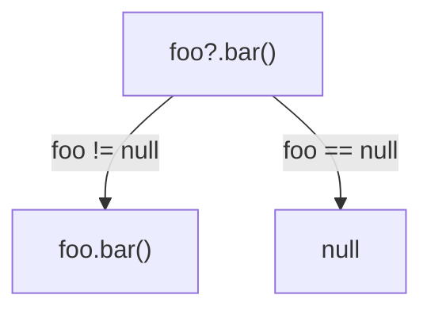
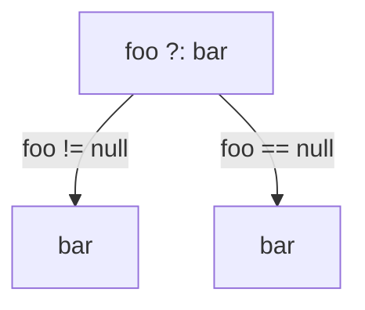
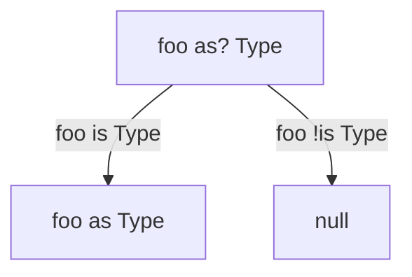

# [Kotlin Roadmap](../roadmap.pdf)

Kotlin is compiled to Java bytecode, which provides the backward compatability. When wishing to see Kotlin in real-life
use J2K converter can be used to convert part of source code into Kotlin. Another way is to start writing unit tests in
Kotlin.

Kotlin standard library is just Java standard library and a bunch of [extensions](#extensions) that provides very smooth
interoperability between Java code and Kotlin code.

In `IntelliJ` we can use the `Show Kotlin bytecode` + `Decompile` features to see the Java alternative for the Kotlin
code.

# `class` / `object` members

## Functions

Calling a top-level function from Java

```kotlin
package intro

fun foo() = 0
```

```java
packge other;

import intro.MyFileKt;

public class UsingFoo {
    public static void main(String[] args) {
        MyFileKt.foo();
    }
}
```

We can use the `@JvmName` to change the name of the package to import.

```kotlin
@file:JvmName("Util")
package intro

fun foo() = 0
```

```java
packge other;

import static intro.Util;

public class JavaUsage {
    public static void main(String[] args) {
        into i = Util.foo();
    }
}
```

### Constructors

## Properties

# Exceptions

In Kotlin, there is no difference between checked and unchecked exceptions. There are no checked exceptions in Kotlin so
there is no need to specify this function throws at this exception. Kotlin's library still has a `@Throws` annotation.
When we throw a checked exception from Java point of view in Kotlin and want to later handle it in Java, we need to add
this annotation.

Java code calling `foo()` won't compile.

```kotlin
fun foo() {
    throw IOException()
}
```

Java code calling `bar()` will compile.

```kotlin
@Throws(IOException::class)
fun bar() {
    throw IOException()
}
```

# Lambdas

## Extensions

## Inline functions

# Nullability

Kotlin took the approach of making NPE a compile-time exception. Each type is a child of the same nullable type. Under
the hood `fun foo(): String? = "foo"` is

```java
@Nullable
public static final String foo() {
    return "foo";
}
```

`fun bar(): String = "bar"` is 

```java
@NotNull
public static final String foo() {
    return "foo";
}
```

Operators to work with nullability in Kotlin

`?.`



`!!`

`s!!` - throws NPE if `s` is null

`?:`



`as?`



# Collections and Sequences
